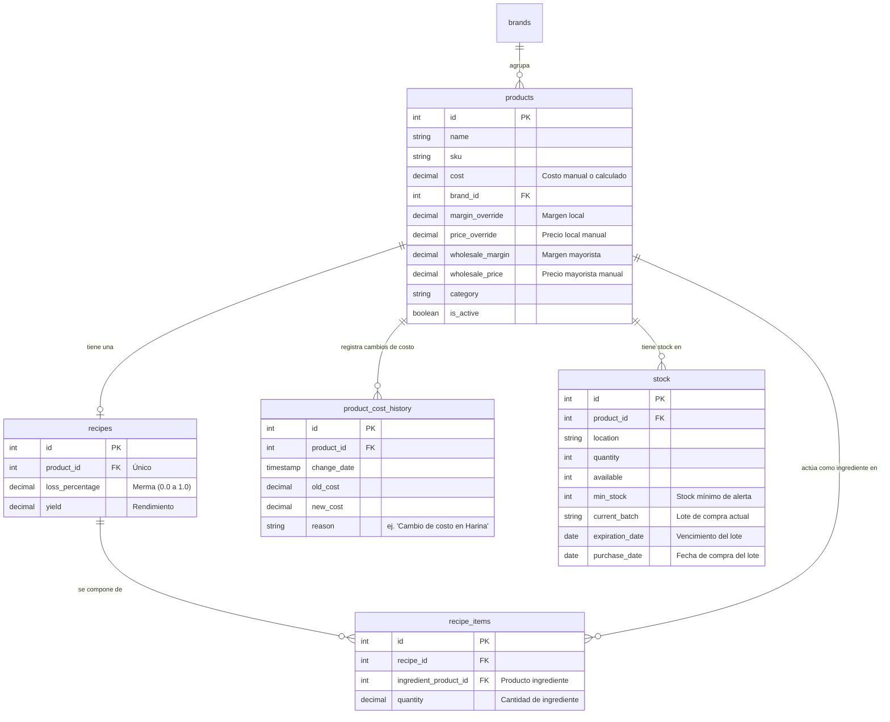

# Data Model Specification: Insumos, Fórmulas y Recetas (Bloque 1)

Este documento especifica las modificaciones al esquema de base de datos de PostgreSQL para dar soporte al modelado unificado de productos/insumos y recetas.

---

## 1. Diagrama de Entidad-Relación (Mermaid)

---

## 2. Definición Detallada de Campos

### 2.1 Extensiones a Tablas Existentes

#### Tabla `products` (Modificaciones)
| Campo | Tipo | Restricciones | Descripción |
| :--- | :--- | :--- | :--- |
| `wholesale_margin` | `DECIMAL(5,2)` | `NULL` | Porcentaje de margen personalizado para el canal mayorista. |
| `wholesale_price` | `DECIMAL(12,2)` | `NULL` | Precio manual fijo para el canal mayorista (sobrescribe margen). |

#### Tabla `stock` (Modificaciones)
| Campo | Tipo | Restricciones | Descripción |
| :--- | :--- | :--- | :--- |
| `min_stock` | `INTEGER` | `DEFAULT 0` | Umbral para alertas de bajo inventario. |
| `current_batch` | `VARCHAR(100)` | `NULL` | Código/identificador del lote actual de compra. |
| `expiration_date` | `DATE` | `NULL` | Fecha de vencimiento asignada al lote actual. |
| `purchase_date` | `DATE` | `NULL` | Fecha en la que se compró/cargó este lote. |

---

## 3. Nuevas Tablas

### 3.1 Tabla `recipes` (Recetas)
Representa la cabecera de la receta de un producto complejo.

| Campo | Tipo | Restricciones | Descripción |
| :--- | :--- | :--- | :--- |
| `id` | `INTEGER` | `PRIMARY KEY, AUTO_INCREMENT` | Identificador único. |
| `product_id` | `INTEGER` | `UNIQUE, REFERENCES products(id) ON DELETE CASCADE` | Producto elaborado (relación 1:1). |
| `loss_percentage` | `DECIMAL(5,2)` | `DEFAULT 0.00` | Coeficiente de pérdida (ej. 0.05 para 5% de merma). |
| `yield` | `DECIMAL(12,4)` | `DEFAULT 1.0000` | Cantidad de unidades terminadas que produce esta receta. |

### 3.2 Tabla `recipe_items` (Ingredientes de la Receta)
Representa el desglose de productos que componen una receta.

| Campo | Tipo | Restricciones | Descripción |
| :--- | :--- | :--- | :--- |
| `id` | `INTEGER` | `PRIMARY KEY, AUTO_INCREMENT` | Identificador único. |
| `recipe_id` | `INTEGER` | `REFERENCES recipes(id) ON DELETE CASCADE` | Receta a la que pertenece. |
| `ingredient_product_id` | `INTEGER` | `REFERENCES products(id) ON DELETE RESTRICT` | Producto que actúa como ingrediente. |
| `quantity` | `DECIMAL(12,4)` | `NOT NULL` | Cantidad utilizada (en unidades bases del producto). |

### 3.3 Tabla `product_cost_history` (Historial de Costos)
Almacena el registro histórico de las variaciones de costos de compra o fabricación.

| Campo | Tipo | Restricciones | Descripción |
| :--- | :--- | :--- | :--- |
| `id` | `INTEGER` | `PRIMARY KEY, AUTO_INCREMENT` | Identificador único. |
| `product_id` | `INTEGER` | `REFERENCES products(id) ON DELETE CASCADE` | Producto afectado. |
| `change_date` | `TIMESTAMP` | `DEFAULT CURRENT_TIMESTAMP` | Fecha y hora del cambio de costo. |
| `old_cost` | `DECIMAL(12,2)` | `NOT NULL` | Costo anterior. |
| `new_cost` | `DECIMAL(12,2)` | `NOT NULL` | Costo nuevo. |
| `reason` | `VARCHAR(255)` | `NULL` | Razón del cambio (ej. "Aumento de Harina", "Cálculo automático"). |

---

## 4. Reglas de Integridad Referencial y Restricciones
1. **Prevención de eliminación**: No se permite la eliminación de un producto si está siendo utilizado como `ingredient_product_id` en una receta activa (`ON DELETE RESTRICT` en `recipe_items`).
2. **Cascada en Recetas**: Si se elimina un producto elaborado, su receta y los ítems asociados se eliminan en cascada (`ON DELETE CASCADE` en `recipes`).
3. **No circularidad**: En el controlador del backend se validará que no se definan recetas donde un producto final sea ingrediente de sí mismo de forma directa o indirecta (ej. A -> B -> A).
