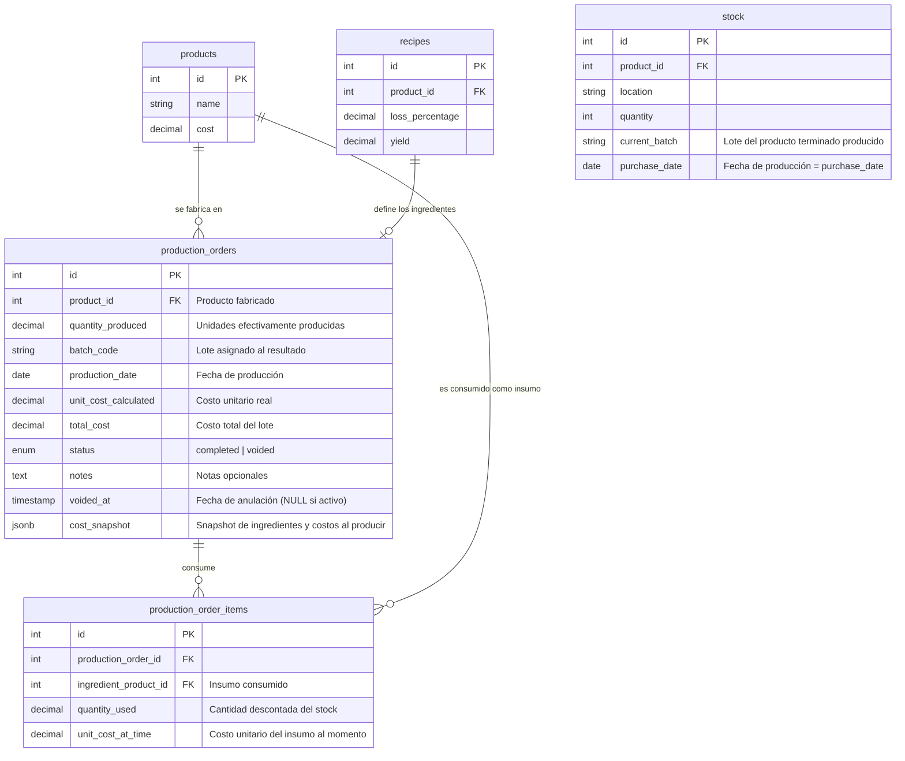

# Data Model Specification: Producción (Bloque 2)

Este documento especifica el esquema de base de datos de PostgreSQL para dar soporte al módulo de Producción, integrado con las tablas de Recetas y Stock del Bloque 1.

---

## 1. Diagrama de Entidad-Relación (Mermaid)



---

## 2. Definición Detallada de Campos

### 2.1 Nueva Tabla: `production_orders`

Representa la cabecera de una orden de fabricación.

| Campo | Tipo | Restricciones | Descripción |
| :--- | :--- | :--- | :--- |
| `id` | `INTEGER` | `PRIMARY KEY, AUTO_INCREMENT` | Identificador único. |
| `product_id` | `INTEGER` | `NOT NULL, FK → products(id)` | Producto terminado que se está fabricando. |
| `quantity_produced` | `DECIMAL(12,4)` | `NOT NULL` | Cantidad de unidades efectivamente producidas. |
| `batch_code` | `VARCHAR(100)` | `NOT NULL` | Código/nombre del lote asignado al resultado (ej. "P-2026-001"). |
| `production_date` | `DATEONLY` | `NOT NULL` | Fecha en la que se ejecutó la producción. |
| `unit_cost_calculated` | `DECIMAL(14,4)` | `NOT NULL` | Costo unitario real calculado al momento de producir. |
| `total_cost` | `DECIMAL(14,2)` | `NOT NULL` | Costo total del lote (unit_cost × quantity_produced). |
| `status` | `ENUM('completed', 'voided')` | `DEFAULT 'completed'` | Estado de la orden. No se elimina, solo se vuelve "voided". |
| `notes` | `TEXT` | `NULL` | Observaciones libres del operador. |
| `voided_at` | `TIMESTAMP` | `NULL` | Fecha y hora de anulación. NULL si no fue anulada. |
| `cost_snapshot` | `JSONB` | `NULL` | Detalle JSON de los ingredientes, cantidades y costos al momento exacto de producción. |
| `created_at` | `TIMESTAMP` | `AUTO` | Timestamp de creación (Sequelize). |
| `updated_at` | `TIMESTAMP` | `AUTO` | Timestamp de última actualización (Sequelize). |

**Índices**:
- `product_id` (para filtrar por producto)
- `production_date` (para filtrar por fecha)
- `batch_code` (para búsqueda por lote)
- `status` (para separar activas de anuladas)

---

### 2.2 Nueva Tabla: `production_order_items`

Representa el detalle de insumos consumidos en una orden de producción.

| Campo | Tipo | Restricciones | Descripción |
| :--- | :--- | :--- | :--- |
| `id` | `INTEGER` | `PRIMARY KEY, AUTO_INCREMENT` | Identificador único. |
| `production_order_id` | `INTEGER` | `NOT NULL, FK → production_orders(id) ON DELETE CASCADE` | Orden de producción a la que pertenece. |
| `ingredient_product_id` | `INTEGER` | `NOT NULL, FK → products(id)` | Producto insumo que fue consumido. |
| `quantity_used` | `DECIMAL(12,4)` | `NOT NULL` | Cantidad efectiva descontada del stock de este insumo. |
| `unit_cost_at_time` | `DECIMAL(14,4)` | `NOT NULL` | Costo unitario del insumo en el momento de la producción (snapshot). |

**Índices**:
- `production_order_id`
- `ingredient_product_id`

---

### 2.3 Tabla `stock` (Sin cambios de esquema)

Los campos `current_batch`, `purchase_date` y `expiration_date` ya fueron incorporados en el Bloque 1. En el módulo de Producción se utilizan de la siguiente forma:

| Campo | Uso en Producción |
| :--- | :--- |
| `current_batch` | Se actualiza con el `batch_code` de la orden de producción al acreditar el stock. |
| `purchase_date` | Se actualiza con la `production_date` de la orden (la producción actúa como la "compra" del producto terminado). |
| `expiration_date` | Opcional: el operador puede ingresar una fecha de vencimiento del lote producido. |

---

## 3. Fórmula de Cálculo de Costo

```
Costo Total Ingredientes = Σ (recipe_item.quantity × product.cost) para cada ingrediente
Rendimiento efectivo     = recipe.yield × quantity_produced (en unidades de receta)
Costo Total Lote         = Costo Total Ingredientes × quantity_produced / recipe.yield / (1 - recipe.loss_percentage)
Costo Unitario Real      = Costo Total Lote / quantity_produced
```

> **Ejemplo**: Receta "Proteína Whey 1kg" — yield=1 unidad, merma=5%, ingredientes cuestan $9.500 por batch de 1 unidad. Para producir 10 unidades:
> - Costo Total = ($9.500 × 10) / (1 × (1 - 0.05)) = $100.000
> - Costo Unitario = $100.000 / 10 = $10.000

---

## 4. Movimientos de Stock al Producir

### Al confirmar una orden (status: 'completed'):

| Tabla | Operación | Detalle |
| :--- | :--- | :--- |
| `stock` (insumos) | `quantity -= quantity_used` | Por cada `production_order_item`, descontar del stock del ingrediente. |
| `stock` (producto terminado) | `quantity += quantity_produced` | Acreditar en la sucursal indicada (default: 'general'). |
| `stock` (producto terminado) | `current_batch = batch_code` | Actualizar lote del producto terminado. |
| `stock` (producto terminado) | `purchase_date = production_date` | Registrar fecha de producción como fecha de entrada al stock. |

### Al anular una orden (status: 'voided'):

| Tabla | Operación | Detalle |
| :--- | :--- | :--- |
| `stock` (insumos) | `quantity += quantity_used` | Revertir el consumo de cada insumo. |
| `stock` (producto terminado) | `quantity -= quantity_produced` | Revertir el acreditado (hasta el disponible). |
| `production_orders` | `status = 'voided'`, `voided_at = NOW()` | Registro lógico, sin DELETE. |

---

## 5. Reglas de Integridad y Restricciones

1. **Receta obligatoria**: No se puede crear una `production_order` si el `product_id` no tiene una receta activa en la tabla `recipes`.
2. **Stock de insumos**: El sistema valida si hay stock suficiente antes de confirmar, pero no bloquea (advertencia no bloqueante).
3. **Inmutabilidad de completadas**: Una vez que una orden está en "completed", sus campos de costo y cantidad no se pueden editar — solo se puede anular.
4. **Snapshot de costo**: El campo `cost_snapshot` almacena el JSON completo de ingredientes y precios al momento de producir, garantizando trazabilidad histórica independiente de cambios futuros.
5. **Cascada en items**: Si se elimina una `production_order` (operación interna, no disponible en la UI), sus `production_order_items` se eliminan en cascada.
