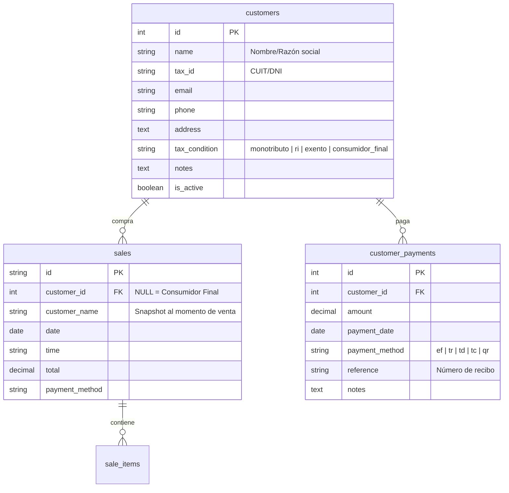

# Data Model: Clientes y Cuentas Corrientes (Bloque 3)

## ER Diagram



## Formulas

### Debt Calculation
```
Saldo_Deudor = Σ(ventas) - Σ(pagos)
```

### Aging Buckets
```
0-30 días: ventas con fecha entre hoy-30 y hoy
31-60 días: ventas con fecha entre hoy-60 y hoy-31
61-90 días: ventas con fecha entre hoy-90 y hoy-61
90+ días: ventas con fecha anterior a hoy-90
```

### Ranking
```
Total_Comprado = Σ(total_ventas) histórico
Frecuencia = count(ventas) / meses_desde_primera_compra
Última_Compra = max(fecha_venta)
```
