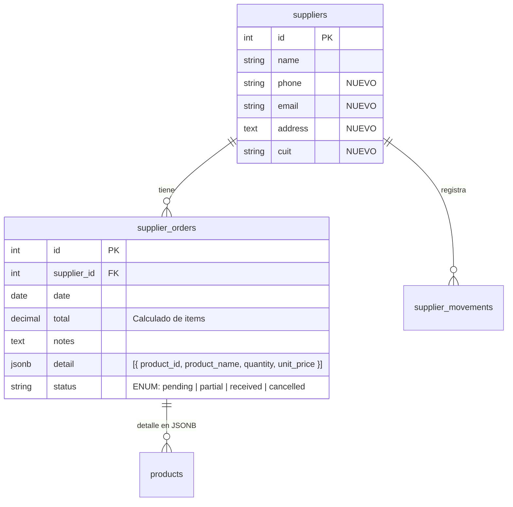

# Data Model: Compras / Órdenes de Compra a Proveedores (Bloque 6)

## ER Diagram



## Status Flow

```
                    ┌──────────┐
                    │ Pending   │
                    └────┬─────┘
                    │
            ┌───────┴────────┐
            ▼                ▼
      ┌──────────┐    ┌──────────┐
      │ Partial   │    │ Cancelled│
      └─────┬────┘    └──────────┘
            │
            ▼
      ┌──────────┐
      │ Received  │
      └──────────┘
```

## Formulas

### Order Total
```
total = Σ(item.quantity × item.unit_price)
```

### Stock Update on Receive
```
For each received item:
  Stock.quantity += item.quantity_received
  Stock.available += item.quantity_received
```
