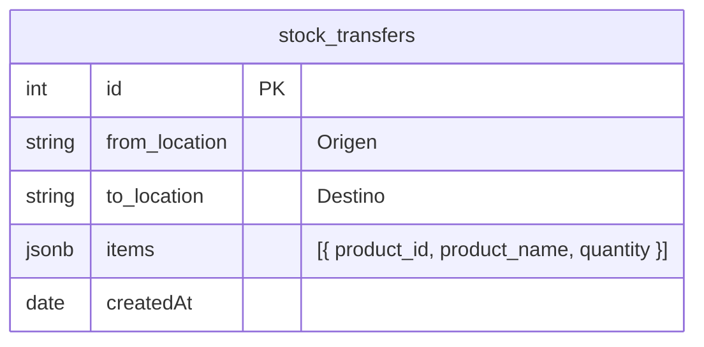

# Data Model: Multi-Sucursal / Transferencias (Bloque 8)

## ER Diagram



## Location Values

| Value | Display |
|:---|:---|
| `general` | General (Jesús) |
| `ortiz` | Ortiz |
| `mayo` | Mayo |

## Transfer Logic

```
1. BEGIN TRANSACTION
2. For each item:
   a. Check: Stock(source, product_id).quantity >= quantity
   b. Decrease: Stock(source, product_id).quantity -= quantity
   c. Increase: Stock(dest, product_id).quantity += quantity
   d. Also update 'available' field
3. Create StockTransfer log record
4. COMMIT
```
